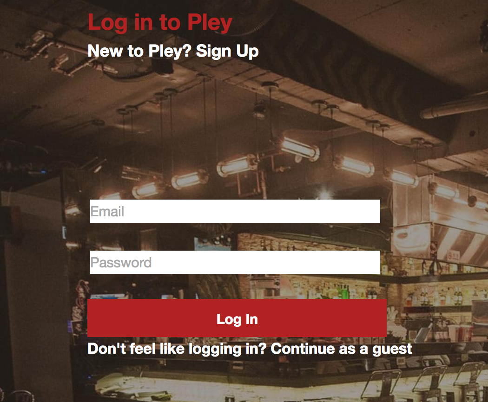

## Pley
[Pley Live][Pley]
* [Pley]: https://www.pley.today/#/

Pley is a full-stack web application inspired by Yelp.  It utilizes Ruby on Rails on the backend, a PostgreSQL database, and React.js with a Redux architectural framework on the frontend.


## How to Use

### Pages
#### 
#### 
#### 
#### 
#### 

### Database
There are tables for users, businesses, tags, taggings, and reviews. All were created using ActiveRecord and are stored in a Postgres database.

```Ruby
create_table "businesses", force: :cascade do |t|
  t.string   "name",               null: false
  t.string   "business_type",      null: false
  t.string   "address",            null: false
  t.string   "phone_number",       null: false
  t.string   "website"
  t.json     "hours",              null: false
  t.boolean  "pickup_delivery"
  t.string   "photo_file_name"
  t.string   "photo_content_type"
  t.integer  "photo_file_size"
  t.datetime "photo_updated_at"
  t.string   "price"
  t.float    "latitude"
  t.float    "longitude"
  t.index ["business_type"], name: "index_businesses_on_business_type", using: :btree
  t.index ["name"], name: "index_businesses_on_name", using: :btree
end
```

### Models
Associations between models are established in ActiveRecord. Businesses belong to users, reviews belong to a business and a user, taggings belong to a restaurant and a tags.

```Ruby
def self.search(query)
  Business
    .left_joins(:tags)
    .where(
      "LOWER(businesses.name) LIKE :query OR LOWER(tags.name) LIKE :query",
      query: "%#{query.downcase}%"
    )
end

def reviewed?(currentUser)
  if currentUser
    self.reviews.any? { |review| review.user_id == currentUser.id }
  else
    false
  end
end

def average_review
  num = 0
  self.reviews.each do |review|
    num = num + review.stars
  end
  return num / self.reviews.length unless self.reviews.length === 0
  nil
end
```

### Views
A RESTful naming convention makes it easy for rails to know what controller method to go to based on the route and url verb and what view to render given the controller method. The controllers and views are nested under an API namespace. All views deconstruct model instances fetched by the controllers into JSON using jBuilder 2.0 to match the frontend which is written in javascript. The current user is bootstrapped onto the window on the root page to allow users to remain logged in.

```Ruby
Rails.application.routes.draw do
  namespace :api, defaults: {format: :json} do
    resources :users, only: [:create, :show]
    resource :session, only: [:create, :destroy, :show]
    resources :businesses, only: [:index, :show]
    resources :reviews, only: [:create, :update, :destroy]
  end

  root "static_pages#root"
end
```


### Actions, Reducers and the Store
jQuery's ajax function is used to fetch JSON from different views. The returned promise dispatches the JSON and the action it executed (i.e fetchBusinesses) to the root reducer through Thunk middleware. Based on the action the root reducer assigns the data to a different section of the store's state.

```javascript
export const fetchBusinesses = (query) => {
  return ($.ajax ({
    method: 'GET',
    url: "api/businesses",
    data: { query }
  }));
};
```

```javascript
export const fetchBusinesses = (query) => dispatch => {
  dispatch(loadSearch());
  return APIUtil.fetchBusinesses(query)
  .then((query) => dispatch(receiveBusinesses(query)));
};

export const receiveBusinesses = businesses => ({
  type: RECEIVE_ALL_BUSINESSES,
  businesses
});
```

```javascript
const reviewReducer = (oldState = {}, action) => {
  Object.freeze(oldState);
  switch (action.type) {
    case RECEIVE_REVIEWS:
      return action.reviews;
    default:
      return oldState;
  }
};

const BusinessesReducer = (state = {}, action) => {
  Object.freeze(state);
  switch(action.type) {
    case RECEIVE_BUSINESS:
      return action.business;
    case REMOVE_REVIEW:
      let newState = merge({}, state);
      const newReviews = newState.reviews.filter((review) => review.id !== action.response.review.id);
      newState.reviews = newReviews;
      newState.reviewed = false;
      return newState;
    case RECEIVE_REVIEW:
      newState = merge({}, state);
      const newReview = action.response.review;
      newState.reviews = state.reviews.map((review) => review.id === newReview.id ? newReview : review);
      if (!newState.reviews.some((review) => review.id === newReview.id)){
        newState.reviews.push(newReview);
      }
      newState.reviewed = action.response.reviewed;
      return newState;
    default:
      return state;
      }
  };

export default BusinessesReducer;
```
### Components
Components are what the user sees on the page. The Header and Search components are rendered on every page. Different components have access to different sections of state. The currentUser is available to the Session, BusinessShow, Search, and ReviewForm components. The business state section is available to the BusinessShow component, the reviewIndex state slice is available to the ReviewIndex and ReviewForm components, the search slice is available to the search component. These components also have children components. The application is a single page and uses React's hashHistory. What components are rendered to the page is determined by the route path after the # as assigned in root component. Components that need to fetch data to render (a business show page needs to get the business reviews) will dispatch an action to make an ajax call when the component has just mounted or is about to mount.

```javascript
constructor(props){
  super(props);
  this.state = {businesses: this.props.businesses};
}

componentWillReceiveProps(newProps){
  const query = this.props.router.location.query.query;
  if (query !== this.prevQuery) {
    newProps.fetchBusinesses(query);
  }
  this.setState({businesses: newProps.businesses});
  this.prevQuery = query;
}

componentDidMount() {
  const query = this.props.router.location.query.query;
  this.props.fetchBusinesses(query);
}
```


### Filters

I plan on utilizing filters to filter out the results by price as well as sorting them by highest review, closest, etc.
